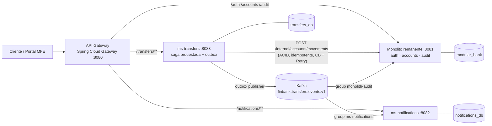

# FinBank — Reto Práctico #4: Modernización del Core Bancario con Strangler Fig

Este repositorio es la **solución completa al Reto Práctico #4** (Módulo 4 — Arquitectura de Microservicios y Sistemas Distribuidos). El enunciado original está en [`docs/Reto_Practico_4_FinBank.pdf`](docs/Reto_Practico_4_FinBank.pdf) y la **documentación de arquitectura del equipo** (diagramas C4, los 12 ADRs y el análisis de trade-offs) es el entregable formal en [`docs/FinBank_Jhonatan_Escobar_Uribe.pdf`](docs/FinBank_Jhonatan_Escobar_Uribe.pdf).

Se parte de un monolito modular bancario (Spring Boot 3, Java 17) y se aplica el patrón **Strangler Fig** para extraer dos microservicios con bases de datos exclusivas, comunicación asíncrona por **Apache Kafka**, patrones de **resiliencia**, **observabilidad distribuida** de extremo a extremo y, como punto extra, una capa de **microfrontends**.

---

## 1. Arquitectura final



- **Decisión central (ADR-007):** el débito + crédito permanece como **una sola transacción ACID** en el módulo `accounts` del monolito, expuesta como endpoint interno idempotente. La saga de `ms-transfers` orquesta estados (`PENDING → COMPLETED / FAILED / COMPENSATED`) y publica eventos mediante **transactional outbox**; nunca parte la transacción del dinero (se prioriza consistencia sobre disponibilidad).
- Los módulos remanentes consumen eventos **sin ser extraídos**: `audit` es un consumidor Kafka idempotente que sigue viviendo dentro del monolito.

---

## 2. Requisitos previos (para correr en local)

| Requisito | Detalle |
|---|---|
| **Docker Desktop** | Incluye Docker Engine + Docker Compose v2. Es **lo único indispensable**. |
| **NO se necesita Java, Maven ni Node** | Todas las imágenes se compilan dentro de Docker con builds *multi-stage* (Maven y Node corren en contenedores temporales durante el `build`). |
| **Recursos de Docker** | Recomendado **≥ 6 GB de RAM** asignados a Docker (son ~19 contenedores, incluidos Kafka y el stack de observabilidad). En Docker Desktop: Settings → Resources. |
| **Puertos libres** | 8080, 8081, 8082, 8083, 8085, 8091, 3000, 9090, 16686, 5432, 5433, 5434, 29092, 8186, 8187, 8188. |

> Probado en Windows 11 con Docker Desktop. Los comandos de prueba de abajo están en PowerShell.

---

## 3. Cómo levantar todo

Desde la raíz del repositorio (donde está `docker-compose.yml`):

```bash
docker compose up -d --build
```

- La **primera vez tarda varios minutos** porque compila el monolito, los 2 microservicios, el gateway y los 3 frontends. Las siguientes veces usa caché.
- Espera a que todo quede sano (~1–2 min tras el build). Verifica el estado:

```bash
docker compose ps
```

Comprobar salud de los servicios Java:

```powershell
8080,8081,8082,8083 | ForEach-Object { "$_ -> " + (Invoke-RestMethod "http://localhost:$_/actuator/health").status }
```

**Detener / limpiar:**

```bash
docker compose down        # detiene y elimina contenedores (conserva los datos en volúmenes)
docker compose down -v     # además borra los volúmenes (resetea las bases de datos)
```

---

## 4. Mapa de contenedores (qué es cada uno)

> 19 contenedores agrupados por rol. La columna "Puerto host" indica cómo accederlo desde tu máquina; los que no exponen puerto solo viven en la red interna del compose.

### Aplicaciones (negocio)
| Contenedor | Para qué sirve | Puerto host |
|---|---|---|
| `gateway` | **API Gateway** (Spring Cloud Gateway). Único punto de entrada; enruta `/transfers/**`, `/notifications/**` y `/auth /accounts /audit` al destino correcto (Strangler Fig). | **8080** |
| `monolith` | **Monolito remanente** (Spring Boot 3). Conserva los módulos `auth`, `accounts` (transacción ACID del dinero) y `audit` (consumidor de eventos). | 8081 |
| `ms-notifications` | **Microservicio 1 (MS1)**. Crea notificaciones consumiendo eventos de Kafka. Base de datos propia. | 8082 |
| `ms-transfers` | **Microservicio 2 (MS2)**. Orquesta la saga de transferencias, outbox y resiliencia; emite eventos por SSE en tiempo real. Base de datos propia. | 8083 |

### Bases de datos (Database-per-Service)
| Contenedor | Para qué sirve | Puerto host |
|---|---|---|
| `postgres-monolith` | PostgreSQL 16 del monolito (`modular_bank`: auth, accounts, audit + schemas legacy congelados). | 5432 |
| `postgres-notifications` | PostgreSQL 16 exclusivo de MS1 (`notifications_db`). | 5433 |
| `postgres-transfers` | PostgreSQL 16 exclusivo de MS2 (`transfers_db`: `transfers` + `outbox`). | 5434 |

### Mensajería (eventos)
| Contenedor | Para qué sirve | Puerto host |
|---|---|---|
| `kafka` | **Apache Kafka 3.7 (KRaft, sin ZooKeeper)**. Broker de eventos: tópico `finbank.transfers.events.v1` y su DLT `.dlt`. | 29092 |
| `kafka-ui` | Interfaz web para inspeccionar tópicos, mensajes, consumer groups y la DLT. | **8091** |

### Microfrontends (punto extra)
| Contenedor | Para qué sirve | Puerto host |
|---|---|---|
| `portal` | **Proxy nginx del portal**. Sirve el shell y los MFEs bajo el mismo origen y enruta `/api/**` al gateway (sin CORS). **Entrar por aquí.** | **8085** |
| `portal-shell` | App Shell (React 18, host de Module Federation): login, sesión JWT en memoria y composición de los MFEs en runtime. | 8186 |
| `portal-mfe-notifications` | MFE de Notificaciones (React, *remote*). | 8187 |
| `portal-mfe-transfers` | MFE de Transferencias (Vue 3, *remote*) con estado en tiempo real vía SSE. | 8188 |

### Observabilidad (los 3 pilares)
| Contenedor | Para qué sirve | Puerto host |
|---|---|---|
| `otel-collector` | Recibe trazas, métricas y logs (OTLP) de los servicios y los reparte a los backends. | — (interno) |
| `jaeger` | Backend y UI de **trazas distribuidas**. | **16686** |
| `prometheus` | Backend de **métricas** (scrapea OTel collector y kafka-exporter). | **9090** |
| `grafana` | **Dashboards** (datasources + dashboard *FinBank — Observabilidad* provisionados). Acceso anónimo con rol Admin (no pide login). | **3000** |
| `loki` | Backend de **logs** estructurados (consultables por `trace_id`). | — (interno, vía Grafana) |
| `kafka-exporter` | Exporta métricas de Kafka (consumer lag por grupo) a Prometheus. | — (interno) |

---

## 5. URLs de acceso

| Qué | URL |
|---|---|
| **Portal bancario (microfrontends)** | http://localhost:8085 |
| **API (gateway — único punto de entrada)** | http://localhost:8080 |
| Grafana (dashboard *FinBank — Observabilidad*) | http://localhost:3000/d/finbank-main |
| Jaeger (trazas) | http://localhost:16686 |
| Prometheus | http://localhost:9090 |
| Kafka UI | http://localhost:8091 |

---

## 6. Prueba rápida de extremo a extremo (smoke test)

```powershell
$base = "http://localhost:8080"   # siempre por el gateway
$reg  = Invoke-RestMethod -Method Post -Uri "$base/auth/register" -ContentType "application/json" `
        -Body (@{email="demo@finbank.com"; password="Password123"; name="Demo"} | ConvertTo-Json)
$H    = @{ Authorization = "Bearer $($reg.accessToken)" }

$acc1 = Invoke-RestMethod -Method Post -Uri "$base/accounts" -Headers $H
$acc2 = Invoke-RestMethod -Method Post -Uri "$base/accounts" -Headers $H

# Las cuentas nacen con saldo 0 (el dominio no tiene endpoint de depósito); se fondea por SQL.
# `docker compose exec` resuelve el nombre del contenedor sin importar el prefijo del proyecto:
docker compose exec postgres-monolith psql -U bank -d modular_bank `
  -c "UPDATE accounts.accounts SET balance=1000 WHERE id='$($acc1.id)';"

# Transferencia (gateway → ms-transfers → accounts ACID → Kafka → notificación + auditoría)
Invoke-RestMethod -Method Post -Uri "$base/transfers" -Headers $H -ContentType "application/json" `
  -Body (@{sourceAccountId=$acc1.id; targetAccountId=$acc2.id; amount=150; reference="demo"} | ConvertTo-Json)

Invoke-RestMethod "$base/notifications" -Headers $H   # notificación creada por MS1 vía Kafka
```

Para ver la transferencia en tiempo real, abre el **portal** en http://localhost:8085, regístrate/inicia sesión y crea una transferencia: el panel "Estado en tiempo real" muestra `PENDING → COMPLETED` (SSE).

---

## 7. Estructura del repositorio

```
modular-bank-java/                 # ← raíz del repo de entrega
├── docker-compose.yml             # orquesta TODA la plataforma (apps + DBs + Kafka + observabilidad + portal)
├── final.md                       # transcripción del enunciado del reto
├── gateway/                       # API Gateway (Spring Cloud Gateway)
│   ├── Dockerfile  ├── pom.xml  └── src/  (rutas en src/main/resources/application.yml)
├── ms-notifications/              # MS1 — microservicio de notificaciones
├── ms-transfers/                  # MS2 — microservicio de transferencias (saga + outbox + resilience4j + SSE)
├── modular-bank-java/             # MONOLITO REMANENTE (Spring Boot 3) — auth, accounts, audit
│   ├── Dockerfile  ├── pom.xml
│   └── src/main/java/com/modularbank/
│       ├── modules/auth/          #   autenticación y emisión de JWT
│       ├── modules/accounts/      #   cuentas y movimientos ACID (incluye endpoint interno /internal/accounts/movements)
│       ├── modules/audit/         #   auditoría — consumidor Kafka idempotente (NO se extrajo)
│       └── shared/                #   seguridad, manejo de errores, infraestructura común
│   └── src/main/resources/db/migration/   # Flyway V1..V7 (V4 transfers y V5 notifications quedan como schemas legacy congelados)
├── portal/                        # ⭐ Microfrontends
│   ├── shell/                     #   App Shell (React 18, host Module Federation)
│   ├── mfe-notifications/         #   MFE Notificaciones (React, remote)
│   ├── mfe-transfers/             #   MFE Transferencias (Vue 3, remote, SSE)
│   └── nginx/                     #   proxy del portal (:8085, mismo origen, /api → gateway)
├── observability/
│   ├── otel-collector.yml         # pipeline OTLP → Jaeger / Prometheus / Loki
│   ├── prometheus.yml             # scrape de OTel collector y kafka-exporter
│   ├── loki-config.yml
│   └── grafana/                   # datasources + dashboard provisionados (dashboards/finbank.json)
└── docs/
    ├── Reto_Practico_4_FinBank.pdf          # enunciado / requerimientos
    └── FinBank_Jhonatan_Escobar_Uribe.pdf  # documento de arquitectura: C4 + 12 ADRs + trade-offs (solución)
```

> ⚠️ **Sobre el nombre repetido `modular-bank-java/modular-bank-java`:** la carpeta raíz del repo se llama `modular-bank-java`; dentro hay una carpeta **también** llamada `modular-bank-java` que es el **código del monolito remanente** (uno de los servicios). No es un error: el monolito es el servicio que conserva su nombre original; el repo agrupa ese monolito junto a los microservicios extraídos.

### Arquitectura interna de cada servicio Java
Cada uno (`gateway`, `ms-notifications`, `ms-transfers`, monolito) usa una **arquitectura hexagonal pragmática** por capas:

```
src/main/java/.../{servicio}/
├── api/              # controllers REST (contrato HTTP)
├── application/      # casos de uso + puertos (interfaces)
├── domain/           # entidades y estados del dominio
└── infrastructure/   # adaptadores: JPA, cliente HTTP (Resilience4j), Kafka, seguridad JWT
src/main/resources/db/migration/   # Flyway (esquema por servicio)
```

---

## 8. Comandos útiles

```bash
# Logs de un servicio en vivo
docker compose logs -f ms-transfers

# Reconstruir un solo servicio (despliegue independiente, p. ej. un microfrontend)
docker compose up -d --build portal-mfe-transfers

# Reiniciar el gateway (necesario si reconstruiste un servicio: Reactor Netty cachea la IP anterior)
docker compose restart gateway

# Inspeccionar la base de un microservicio
docker compose exec postgres-transfers psql -U transfers -d transfers_db
```

---

## 9. Plan de implementación (resumen del desarrollo)

- **Fase 0 — Línea base:** monolito original corriendo en Docker; estructura del repo de entrega.
- **Fase 1 — Paso 1 (extracción de notifications / MS1):** microservicio hexagonal con DB propia (`notifications_db`) y Flyway propio; mismo contrato HTTP `GET /notifications`; gateway enruta `/notifications/**` a MS1 y el resto al monolito (gateway toma el 8080, monolito pasa al 8081).
- **Fase 2 — Paso 2 (extracción de transfers / MS2 + Kafka):** MS2 con DB propia (`transfers` + `outbox`); saga orquestada (PENDING/COMPLETED/FAILED/COMPENSATED) contra el endpoint ACID idempotente `POST /internal/accounts/movements`; outbox publisher → Kafka (envelope CloudEvents + `traceparent`); MS1 y `audit` del monolito consumen eventos de forma idempotente; se eliminan del monolito los módulos transfers y notifications.
- **Fase 3 — Paso 3 (resiliencia y contratos):** Resilience4j en MS2 (Circuit Breaker + Retry/backoff + Fallback 503); Retry con backoff + DLQ en los consumidores; contratos de eventos versionados (CloudEvents) y diagramas de secuencia happy/failure.
- **Fase 4 — Paso 4 (observabilidad):** OTel Java agent en los 4 servicios; Jaeger + Prometheus + Grafana + Loki + kafka-exporter; un único TraceId E2E que cruza el hop de Kafka; logs JSON con `trace_id`; dashboard con P99, tasa de errores, throughput y consumer lag.
- **Fase 5 — Paso 5 (ADRs y trade-offs):** ADR-001…ADR-012 + análisis de trade-offs (en el PDF de arquitectura en `docs/`).
- **Fase 6 — Punto extra (microfrontends):** App Shell React + MFE React + MFE Vue 3 con Module Federation; JWT compartido solo en memoria; SSE de estado de transferencia; portal nginx :8085; despliegue independiente por contenedor.

---

## 10. Notas operativas

- **`/internal/**` no se enruta en el gateway:** los endpoints internos (movements del monolito, compensate de MS2) solo son alcanzables dentro de la red del compose, no desde fuera.
- **Cuentas con saldo 0:** el dominio original no tiene endpoint de depósito; las pruebas fondean por SQL directo (ver §6).
- **Grafana:** acceso anónimo con rol Admin — no pide usuario/contraseña; entra directo al dashboard.
- **Reconstruir un servicio individual** (`docker compose up -d --build <svc>`): reinicia también el gateway (`docker compose restart gateway`), porque Reactor Netty cachea la IP del contenedor anterior.
- El resumen del plan de implementación (que vivía en `specs/`) queda preservado en §9 de este README.

---

## 11. Documentación

- **Requerimientos del reto:** [`docs/Reto_Practico_4_FinBank.pdf`](docs/Reto_Practico_4_FinBank.pdf)
- **Documento de arquitectura (solución):** [`docs/FinBank_Jhonatan_Escobar_Uribe.pdf`](docs/FinBank_Jhonatan_Escobar_Uribe.pdf) — diagramas C4 (contexto, contenedores, componentes), los 12 ADRs y el análisis de trade-offs. Es el entregable formal del Paso 5.
