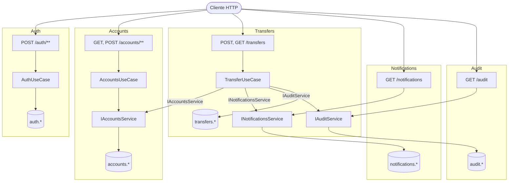
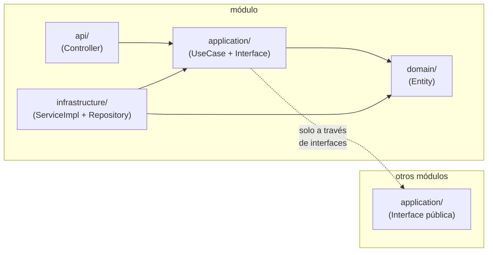
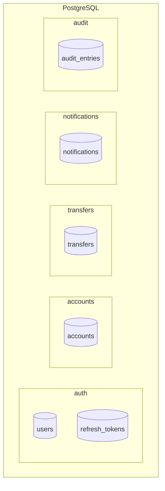

# modular-bank-java

Monolito modular bancario implementado en Java / Spring Boot 3. Referencia técnica para migración a microservicios.

## Requisitos
- Java 17+
- Maven 3.9+
- Docker

## Ejecutar

```bash
docker-compose up -d
mvn spring-boot:run
```

## Módulos

| Módulo | Schema | Interfaz pública |
|---|---|---|
| auth | auth.* | — (solo JWT) |
| accounts | accounts.* | AccountsService |
| transfers | transfers.* | — (orchestrador) |
| notifications | notifications.* | NotificationsService |
| audit | audit.* | AuditService |

## Arquitectura

### Dependencias entre módulos



### Capas internas de cada módulo



### Aislamiento de schemas en PostgreSQL


